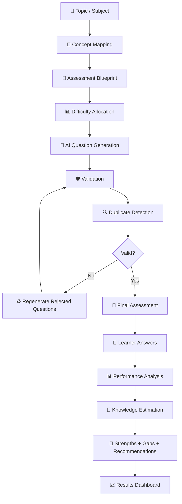
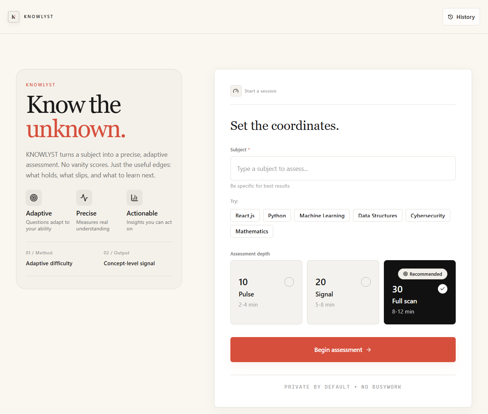
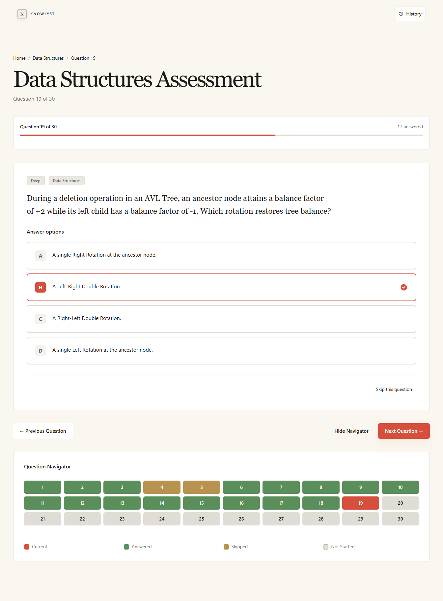
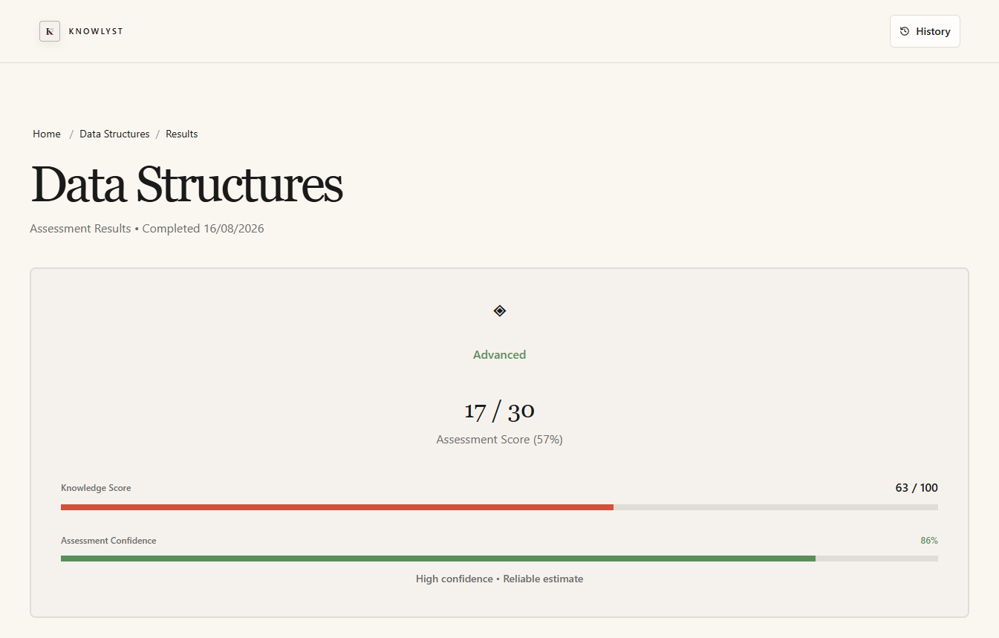
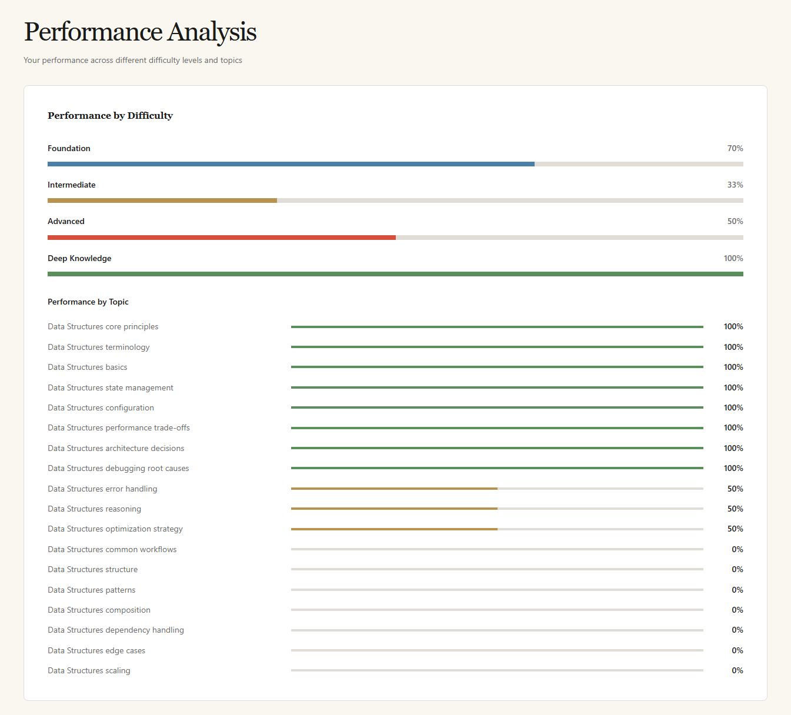
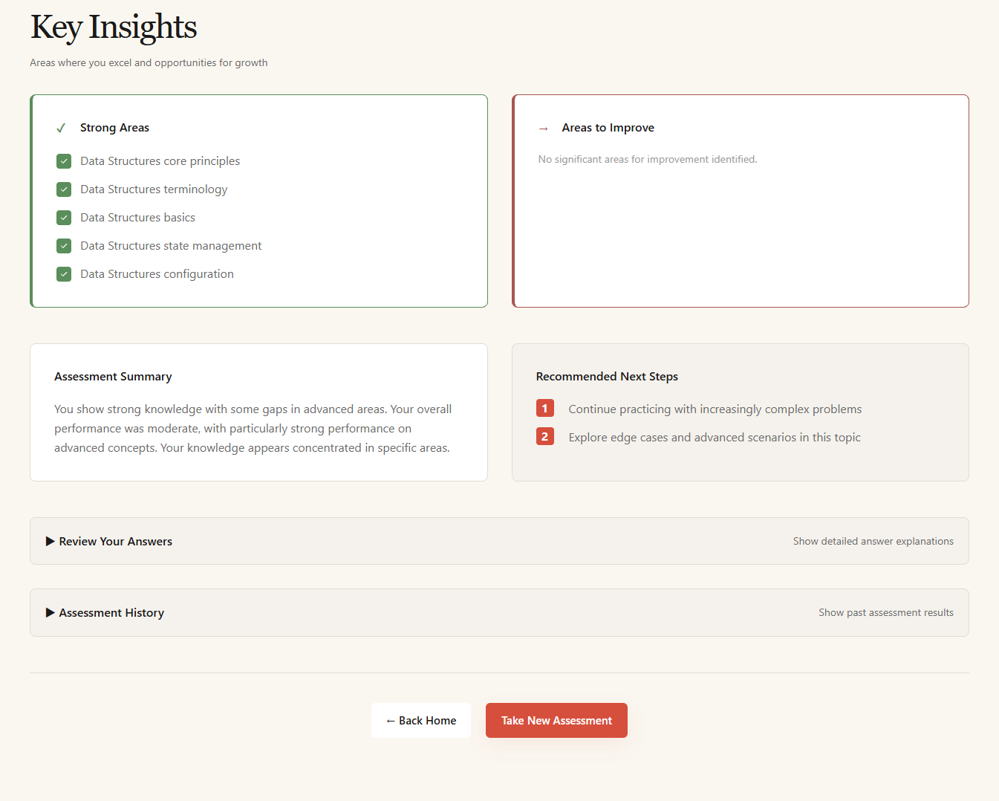
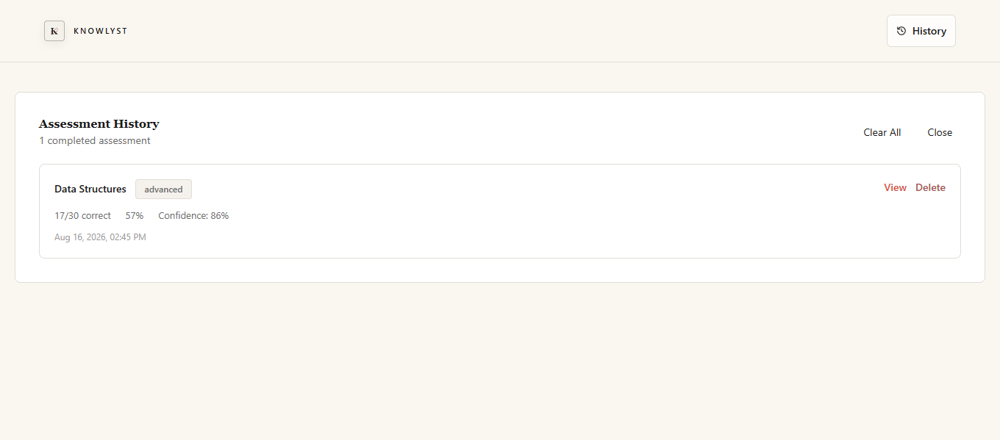

# KNOWLYST

> **Know the unknown.**

**KNOWLYST** is an AI-powered diagnostic knowledge assessment platform designed to go beyond simple quiz scores.

Instead of asking only **“How many questions did you get right?”**, KNOWLYST asks:

> **“How deeply do you actually understand this topic?”**

It generates structured assessments across multiple difficulty levels, validates and refines AI-generated questions, analyzes performance across different dimensions, and turns the results into actionable insights about **strengths, knowledge gaps, confidence, and what to learn next**.

---

<div align="center">


</div>

---

## 🧭 Why KNOWLYST?

Most quiz applications reduce learning to a single number:

```text
                    ┌───────────────┐
                    │   24 / 30     │
                    │     80%       │
                    └───────────────┘
                           ↓
                    "You did well."
```

KNOWLYST takes a different approach.

```text
                         KNOWLYST
                            │
              ┌─────────────┼─────────────┐
              ↓             ↓             ↓
         What you know   What you miss   What's next
              │             │             │
              └─────────────┼─────────────┘
                            ↓
                  Diagnostic Insight
```

The goal is not to produce a **vanity score**.

The goal is to make understanding **visible, measurable, and actionable**.

---

## ✨ What Makes KNOWLYST Different?

### 🧠 Layered Assessment

Questions progress through multiple levels of cognitive depth:

**Foundation → Intermediate → Advanced → Deep → Verification**

This allows the system to probe whether understanding survives as complexity increases.

### 🤖 AI-Generated Assessments

A topic supplied by the learner is transformed into a structured assessment using Google Gemini.

### 🛡️ Question Quality Control

AI-generated questions pass through validation and duplicate detection before reaching the learner.

### 🔄 Automatic Regeneration

When generated questions fail validation or quality requirements, KNOWLYST can regenerate the rejected items rather than returning a weak assessment.

### 📊 Multi-Dimensional Analysis

Performance isn't treated as a single percentage.

The analysis considers:

- Overall accuracy
- Difficulty-level performance
- Topic performance
- Question-type performance
- Consistency
- Deep-performance signals
- Topic coverage
- Confidence
- Knowledge level

### 🎯 Actionable Feedback

The final result identifies:

**Strengths → Weaknesses → Knowledge Level → Recommendations**

---

## 🧩 Core Features

| Feature | Description |
|---|---|
| 🤖 **AI Assessment Generation** | Generate assessments from any supported subject or topic |
| 📈 **Progressive Difficulty** | Move from fundamentals to advanced and deep reasoning |
| 🧠 **Knowledge Estimation** | Estimate proficiency using multiple performance signals |
| 🔍 **Question Validation** | Validate AI-generated question structure and quality |
| ♻️ **Duplicate Detection** | Detect and remove repeated or near-duplicate questions |
| 🔄 **Regeneration** | Replace rejected questions automatically |
| 📊 **Performance Analytics** | Analyze performance across difficulty, topics, and question types |
| 🎯 **Recommendations** | Surface learning direction based on assessment performance |
| 📝 **Answer Review** | Review individual questions with explanations |
| 🕘 **Assessment History** | Persist completed assessments using browser `localStorage` |
| 💬 **Confidence Analysis** | Provide a confidence signal alongside the knowledge estimate |

---

## 🔬 How KNOWLYST Works



### The Pipeline

1. **Choose a topic** and assessment size.
2. The frontend sends the request to the backend.
3. The backend builds an assessment blueprint.
4. The blueprint determines the intended difficulty distribution.
5. Gemini generates question batches.
6. Generated questions are structurally validated.
7. Duplicate or near-duplicate questions are filtered.
8. Rejected questions are regenerated when necessary.
9. The final assessment is returned to the client.
10. The learner completes the assessment.
11. The analysis engine evaluates multiple performance signals.
12. KNOWLYST estimates knowledge depth and confidence.
13. The results dashboard presents strengths, gaps, and recommendations.

---

## 🧠 Knowledge Assessment Model

KNOWLYST deliberately avoids treating:

```text
Correct Answers ÷ Total Questions
```

as the complete representation of knowledge.

Instead, the analysis layer evaluates several signals.

```text
                    Learner Responses
                           │
          ┌────────────────┼────────────────┐
          ↓                ↓                ↓
     Accuracy          Difficulty        Topic
          │                │                │
          ↓                ↓                ↓
   Question Type      Consistency     Deep Performance
          │                │                │
          └────────────────┼────────────────┘
                           ↓
                    Topic Coverage
                           ↓
                    Confidence Signal
                           ↓
                  Knowledge Classification
                           ↓
                Recommendations & Insights
```

The analysis layer currently calculates:

- Overall accuracy
- Performance by difficulty
- Performance by topic
- Performance by question type
- Consistency across difficulty levels
- Deep-performance signals
- Topic coverage
- Confidence score
- Knowledge-level classification
- Summary recommendations

> **Important:** KNOWLYST is a practical diagnostic model. It does not claim to measure absolute intelligence or provide a scientifically validated psychometric measurement.

---

## 📚 Difficulty Framework

KNOWLYST structures assessment depth into five stages.

| Stage | Purpose |
|---|---|
| 🟢 **Foundation** | Terminology, basic principles, and entry-level understanding |
| 🔵 **Intermediate** | Relationships, workflows, and practical application |
| 🟠 **Advanced** | Complex reasoning, trade-offs, and multi-step scenarios |
| 🔴 **Deep** | Edge cases, expert reasoning, and root-cause analysis |
| 🟣 **Verification** | Targeted probing to verify whether apparent understanding is genuine |

This framework is implemented through the assessment blueprint and prompt-building logic.

Primary implementation:

```text
server/src/services/promptBuilder.ts
```

---

## 🏗️ Architecture

KNOWLYST uses a split full-stack architecture.

```text
┌──────────────────────────────────────────────────────────────┐
│                         KNOWLYST                             │
└──────────────────────────────────────────────────────────────┘
                              │
                              ↓
┌──────────────────────────────────────────────────────────────┐
│                     React + TypeScript                       │
│                                                              │
│  Topic Setup → Assessment → Results → History                │
└──────────────────────────────┬───────────────────────────────┘
                               │
                               │ HTTP API
                               ↓
┌──────────────────────────────────────────────────────────────┐
│                 Node.js + Express + TypeScript               │
│                                                              │
│  Validation → Blueprint → Generation → Filtering → Retry     │
└──────────────────────────────┬───────────────────────────────┘
                               │
                               ↓
┌──────────────────────────────────────────────────────────────┐
│                         Gemini API                            │
│                                                              │
│                 AI Assessment Generation                      │
└──────────────────────────────────────────────────────────────┘
```

### Frontend

The frontend is a Vite + React + TypeScript single-page application.

**Responsibilities:**

- Topic and assessment setup
- Question presentation
- Answer collection
- Results visualization
- Knowledge analysis
- Assessment history

**Core technologies:**

- React 18
- TypeScript
- Vite
- Tailwind CSS
- Lucide React
- Motion / Framer Motion
- Recharts

### Backend

The backend is a Node.js + Express service written in TypeScript.

**Responsibilities:**

- Request validation
- Assessment blueprint generation
- AI orchestration
- Question validation
- Duplicate detection
- Regeneration
- Error handling
- API responses

### AI Layer

Google Gemini powers question generation.

The backend:

- Keeps the API key server-side
- Builds structured generation prompts
- Requests structured JSON responses
- Validates generated output
- Retries transient failures
- Surfaces explicit application errors

---

## 🔄 Request Data Flow

```text
Client
  │
  │ POST /api/assessment/generate
  ↓
Request Validation
  │
  ↓
Assessment Blueprint
  │
  ↓
Difficulty Allocation
  │
  ↓
Gemini Generation
  │
  ↓
Question Validation
  │
  ↓
Duplicate Detection
  │
  ├── Invalid ──→ Regeneration
  │                    │
  │                    └──────→ Validation
  │
  └── Valid
        ↓
Final Assessment
        ↓
Client
        ↓
Learner Answers
        ↓
Analysis Engine
        ↓
Knowledge Score + Confidence
        ↓
Recommendations
```

---

## 🛠️ Tech Stack

| Layer | Technology | Purpose |
|---|---|---|
| Frontend | React | UI and application flow |
| Language | TypeScript | Type-safe application development |
| Build Tool | Vite | Frontend development and builds |
| Styling | Tailwind CSS | Responsive UI and design system |
| Icons | Lucide React | Interface iconography |
| Motion | Motion / Framer Motion | UI animation and transitions |
| Charts | Recharts | Performance visualization |
| Backend | Node.js | Server runtime |
| API | Express | REST API |
| Validation | Zod | Request/output validation |
| AI | Google Gemini API | AI assessment generation |
| Storage | `localStorage` | Assessment history |
| Frontend Hosting | Netlify | Production frontend |
| Backend Hosting | Render | Production API |

---

## 📁 Project Structure

```text
knowlyst/
│
├── client/
│   ├── public/
│   └── src/
│       ├── components/
│       │   ├── assessment/
│       │   ├── common/
│       │   ├── home/
│       │   ├── layout/
│       │   └── results/
│       │
│       ├── context/
│       ├── hooks/
│       ├── services/
│       ├── types/
│       ├── utils/
│       │
│       ├── App.tsx
│       ├── index.css
│       └── main.tsx
│
├── server/
│   └── src/
│       ├── config/
│       ├── controllers/
│       ├── middleware/
│       ├── services/
│       ├── types/
│       ├── validators/
│       └── index.ts
│
├── package.json
├── README.md
├── .gitignore
└── .env
```

### Key Implementation Files

| File | Responsibility |
|---|---|
| `client/src/services/api.ts` | Frontend API communication |
| `client/src/services/analysis.ts` | Knowledge analysis and recommendations |
| `server/src/services/promptBuilder.ts` | Assessment blueprint and prompt construction |
| `server/src/services/geminiClient.ts` | Gemini API communication |
| `server/src/services/assessmentGenerator.ts` | Generation, validation, duplicate filtering, regeneration |
| `server/src/config/env.ts` | Environment validation |
| `server/src/index.ts` | Express server and CORS configuration |

---

# 🚀 Getting Started

## Prerequisites

Make sure you have:

- **Node.js 18+** or a compatible current LTS version
- **npm**
- A **Google Gemini API key**

---

## 1. Clone the Repository

```bash
git clone <your-repository-url>
cd knowlyst
```

---

## 2. Install Dependencies

From the project root:

```bash
npm install
npm install --prefix client
npm install --prefix server
```

Or use the root installation script:

```bash
npm run install:all
```

---

## 3. Configure Environment Variables

Create a `.env` file in the project root:

```env
GEMINI_API_KEY=your_gemini_api_key
GEMINI_MODEL=gemini-3.6-flash
CORS_ORIGIN=http://localhost:5173
PORT=3000
NODE_ENV=development
```

### Frontend

The frontend can optionally use:

```env
VITE_API_URL=http://localhost:3000
```

The application can fall back to `/api` when using the local Vite proxy configuration.

> 🔐 **Never expose `GEMINI_API_KEY` to the frontend.**

---

# ⚡ Running Locally

### Option 1 — Run Everything

From the root:

```bash
npm run dev
```

### Option 2 — Run the Backend

```bash
cd server
npm run dev
```

### Option 3 — Run the Frontend

In another terminal:

```bash
cd client
npm run dev
```

Once both services are running, open the frontend URL provided by Vite.

---

# 📦 Production Build

Build the entire project:

```bash
npm run build
```

Or build each application independently.

### Frontend

```bash
npm run build --prefix client
```

### Backend

```bash
npm run build --prefix server
```

---

# ☁️ Deployment

KNOWLYST uses a split deployment architecture.

```text
                 INTERNET
                     │
                     ↓
          ┌────────────────────┐
          │      Netlify       │
          │                    │
          │  React + Vite SPA  │
          └─────────┬──────────┘
                    │
                    │ HTTPS API
                    ↓
          ┌────────────────────┐
          │      Render        │
          │                    │
          │ Express + Node API │
          └─────────┬──────────┘
                    │
                    ↓
          ┌────────────────────┐
          │    Gemini API      │
          │                    │
          │ AI Generation      │
          └────────────────────┘
```

## Netlify

Recommended configuration:

```text
Base directory:       client
Build command:        npm run build
Publish directory:    client/dist
```

Environment variable:

```env
VITE_API_URL=https://YOUR-RENDER-SERVICE.onrender.com
```

The current application does not use `react-router-dom`, so a route redirect configuration is not currently required.

---

## Render

Recommended configuration:

```text
Root directory:       server
Build command:        npm install && npm run build
Start command:        npm run start
```

Environment variables:

```env
GEMINI_API_KEY=your_gemini_api_key
GEMINI_MODEL=gemini-3.6-flash
CORS_ORIGIN=https://YOUR-NETLIFY-SITE.netlify.app
NODE_ENV=production
```

Render provides the production `PORT` environment variable when required.

---

# 🔌 API

## Health Check

```http
GET /api/health
```

Returns a simple health response containing the server status and timestamp.

---

## Generate Assessment

```http
POST /api/assessment/generate
```

### Request

```json
{
  "topic": "React",
  "questionCount": 30
}
```

### Response

```json
{
  "assessment": {
    "topic": "React",
    "questionCount": 30
  },
  "questions": [
    {
      "id": "q1",
      "question": "...",
      "options": [
        "A",
        "B",
        "C",
        "D"
      ],
      "correctAnswer": 1,
      "difficulty": "foundation",
      "topic": "React",
      "concept": "state management",
      "questionType": "conceptual",
      "explanation": "..."
    }
  ]
}
```

The server returns structured application errors when validation or generation fails.

---

# 🛡️ Reliability & Error Handling

AI systems can produce unpredictable output.

KNOWLYST therefore treats AI generation as a pipeline that requires validation rather than blindly trusting the model.

### Current Safeguards

```text
AI Output
   │
   ↓
Schema Validation
   │
   ↓
Quality Checks
   │
   ↓
Duplicate Detection
   │
   ├── Rejected → Regenerate
   │
   └── Accepted
          ↓
      Assessment
```

Implemented mechanisms include:

- Zod request validation
- Gemini response validation
- Duplicate detection
- Regeneration of rejected questions
- Retry handling for transient Gemini failures
- Explicit API-key error handling
- Rate-limit handling
- Timeout handling
- Service-error handling
- Frontend network-error handling

---

# 🧪 Testing

Assessment-generation logic includes a server-side test file:

```text
server/src/services/assessmentGenerator.test.ts
```

The current repository does not define a dedicated root-level `npm test` script.

The test file can be executed using Node's test runner when the project environment is configured appropriately.

---

# 🔐 Security

Security-sensitive configuration is intentionally kept server-side.

### Current Principles

- 🔑 Gemini API keys are stored in environment variables.
- 🚫 Gemini secrets are never embedded in the frontend.
- 🌐 CORS is controlled by the backend.
- 🧹 Backend inputs are validated before reaching the generation pipeline.
- ⚠️ Invalid generation responses are rejected instead of blindly trusted.

---

# 🎨 Design Philosophy

KNOWLYST is built around one principle:

> **No vanity scores. Understand what holds, what slips, and what to learn next.**

The product is intentionally positioned as a **diagnostic knowledge tool**, not simply another quiz generator.

The distinction is important:

```text
Quiz App
   │
   └── "You scored 80%."

KNOWLYST
   │
   ├── What do you understand?
   ├── Where does understanding weaken?
   ├── How consistent is it?
   ├── How deep does it go?
   └── What should you learn next?
```

---

# 🗺️ Roadmap

KNOWLYST is currently focused on building a strong diagnostic assessment foundation.  
The next stage is to evolve it from a knowledge assessment tool into a personalized learning intelligence platform.

### 👤 Personalization

| Status | Feature | Direction |
|:---:|---|---|
| 🔲 | **User Authentication** | Secure learner accounts and personalized experiences |
| 🔲 | **Learner Profiles** | Build a persistent knowledge profile for each learner |
| 🔲 | **Cloud Assessment History** | Store and access assessments across devices |

### 🧠 Intelligence

| Status | Feature | Direction |
|:---:|---|---|
| 🔲 | **Advanced Knowledge Modeling** | Develop richer models for estimating knowledge depth |
| 🔲 | **Personalized Learning Paths** | Generate learning paths based on identified knowledge gaps |
| 🔲 | **Advanced Recommendations** | Recommend specific concepts and resources to improve weak areas |

### 📊 Analytics

| Status | Feature | Direction |
|:---:|---|---|
| 🔲 | **Longitudinal Analytics** | Track how knowledge changes over time |
| 🔲 | **Progress Tracking** | Visualize improvement across repeated assessments |
| 🔲 | **Historical Comparisons** | Compare current knowledge against previous assessments |

### 🤖 AI Evolution

| Status | Feature | Direction |
|:---:|---|---|
| 🔲 | **Multi-Model Support** | Support additional AI providers and models |
| 🔲 | **Adaptive Assessments** | Dynamically adjust question difficulty based on responses |
| 🔲 | **Smarter Question Generation** | Improve question diversity, depth, and contextual relevance |

---

> **The long-term vision:** move from *“How much did you score?”* to *“What do you understand, where are your gaps, and what should you learn next?”*

---

# 📸 Screenshots

<div align="center">

## 🏠 Home



---

## 📝 Assessment



---

## 📊 Results Dashboard



---

## 📈 Detailed Results



---

## 🎯 Knowledge Insights



---

## 🕘 Assessment History



</div>

---

# 🤝 Contributing

Contributions are welcome when they improve the quality, correctness, or usefulness of KNOWLYST without compromising its core diagnostic philosophy.

### Contribution Workflow

```text
Fork
  ↓
Create Feature Branch
  ↓
Make Focused Changes
  ↓
Run Builds / Validation
  ↓
Open Pull Request
```

### Suggested Workflow

```bash
git checkout -b feature/your-feature
```

Make your changes, validate the frontend and backend, then open a pull request with a clear explanation of what changed and why.

---

# 📄 License

No license file is currently included in the repository.

Therefore, **the project does not currently declare an open-source license**.

---

# 🧠 The Idea Behind KNOWLYST

Knowledge is rarely binary.

Someone can remember terminology but struggle to apply it.

Someone can solve familiar problems but fail when the context changes.

Someone can perform well on fundamentals while having little understanding of deeper concepts.

KNOWLYST is built around exploring those differences.

```text
                    KNOWLEDGE
                        │
        ┌───────────────┼───────────────┐
        ↓               ↓               ↓
   Fundamentals     Application       Reasoning
        │               │               │
        └───────────────┼───────────────┘
                        ↓
                   Consistency
                        │
                        ↓
                      Depth
                        │
                        ↓
                 Understanding
```

The objective isn't simply to determine whether an answer is **right or wrong**.

It is to understand **how far the learner's understanding goes**.

---

<div align="center">

## KNOWLYST

**Know the unknown.**

*Measure understanding. Find the gaps. Learn what matters next.*

</div>
