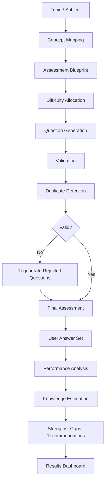

# KNOWLYST

> Know the unknown.

A diagnostic knowledge assessment platform that generates AI-powered topic assessments, measures understanding across difficulty levels, and surfaces the strengths, gaps, and next steps that matter most.


## Overview

KNOWLYST is not a vanity quiz app. It is designed to estimate how deeply a learner understands a topic by combining AI-generated questions with layered analysis of performance across concept difficulty, topic coverage, and confidence.

Traditional assessment tools often reduce a learner to a single percentage. This app approaches the problem differently: it asks whether the learner can explain fundamentals, handle practical scenarios, reason under complexity, and sustain understanding at higher levels of depth.

The experience revolves around a simple idea: identify what is known, what is weak, and what should be learned next.

## Key Features

- AI-generated topic assessments from a user-provided subject or topic
- Difficulty progression from foundation through deep reasoning
- Validation and duplicate detection to prevent weak or repeated questions
- Regenerative question generation when a batch fails quality checks
- Results dashboard with score, confidence, and performance signals
- Topic and question-type performance analysis
- Knowledge level estimation based on difficulty and consistency
- Personalized recommendations and summary feedback
- Assessment history stored in browser localStorage
- Answer review with explanations and question-by-question insight

## How It Works



The assessment pipeline is implemented across both the client and server:

1. The user chooses a topic and assessment size.
2. The frontend calls the backend API to generate an assessment.
3. The backend builds a difficulty blueprint using the topic and number of questions.
4. Gemini generates question batches tailored to the topic and learner depth.
5. Generated questions are validated for structure, quality, and expected count.
6. Duplicate or near-duplicate items are removed and replaced.
7. The final assessment is delivered to the client.
8. The client analyzes the learner’s answers and estimates knowledge depth.
9. Results show performance, confidence, strengths, weaknesses, and learning direction.

## Knowledge Assessment Model

The application estimates knowledge using signals from the user's answers rather than a raw “percent correct” alone.

The analysis layer in `client/src/services/analysis.ts` calculates:

- overall accuracy
- per-difficulty performance
- topic performance
- question-type performance
- consistency across difficulty levels
- deep-performance signals
- topic coverage
- confidence score
- knowledge level classification
- summary recommendations

This is a practical diagnostic model, not a claim of absolute intelligence measurement. The app is designed to estimate proficiency and diagnostic confidence based on how a user performs across layered question types and difficulty bands.

## Difficulty Framework

The backend generates questions across a staged depth model:

- Foundation: entry-level understanding, terminology, and basic principles
- Intermediate: relationships, common workflows, and practical application
- Advanced: more complex reasoning, trade-offs, and multi-step scenarios
- Deep: expert-style reasoning, edge cases, and root-cause analysis
- Verification: targeted probing to confirm whether the user’s apparent level is genuine

This is defined in the prompt builder and blueprint generation logic in `server/src/services/promptBuilder.ts`.

## Technical Architecture

### Frontend

The frontend is a Vite + React + TypeScript SPA built for an interactive assessment experience.

Key technologies:

- React 18
- TypeScript
- Vite
- Tailwind CSS
- Lucide React icons
- Framer Motion / `motion` package
- Recharts for visualization

The UI is organized into a simple state-driven flow:

- home screen for topic entry and assessment setup
- assessment screen for answering questions
- results dashboard for analysis and recommendations
- history screen for local saved results

### Backend

The backend is a Node.js + Express service written in TypeScript.

Responsibilities include:

- validating incoming assessment requests
- building the assessment blueprint
- orchestrating AI question generation
- validating output quality
- filtering duplicates
- handling regeneration logic
- returning structured assessment data to the frontend

### AI Layer

The AI layer uses Google Gemini via the backend client in `server/src/services/geminiClient.ts`.

Important characteristics:

- model configuration is sourced from environment variables
- requests are sent server-side only
- system prompts and question-generation instructions are assembled in `promptBuilder.ts`
- structured JSON responses are expected from Gemini
- the app includes retry logic for transient failures
- invalid or blocked responses raise explicit application errors

### Data Flow

```text
Client form input
  ↓
POST /api/assessment/generate
  ↓
Input validation
  ↓
Assessment blueprint creation
  ↓
Gemini question generation
  ↓
Question validation + duplicate detection
  ↓
Regeneration if needed
  ↓
Final assessment payload
  ↓
Results analysis in the browser
  ↓
Knowledge score, confidence, recommendations
```

## Tech Stack

| Layer | Technology | Purpose |
| --- | --- | --- |
| Frontend | React, TypeScript, Vite | SPA UI and app state |
| Styling | Tailwind CSS | Design system and responsive UI |
| Visualization | Recharts | Results and performance charts |
| Motion | motion / Framer Motion | UI transitions and polish |
| Backend | Node.js, Express, TypeScript | API and assessment orchestration |
| Validation | Zod | Request and output validation |
| AI | Google Gemini API | Assessment generation |
| Storage | browser localStorage | persistent assessment history |
| Deployment target | Netlify + Render | frontend/backend hosting |

## Project Structure

```text
knowlyst/
├── client/
│   ├── public/
│   ├── src/
│   │   ├── App.tsx
│   │   ├── index.css
│   │   ├── main.tsx
│   │   ├── components/
│   │   │   ├── assessment/
│   │   │   ├── common/
│   │   │   ├── home/
│   │   │   ├── layout/
│   │   │   └── results/
│   │   ├── context/
│   │   ├── hooks/
│   │   ├── services/
│   │   ├── types/
│   │   └── utils/
│   ├── package.json
│   ├── vite.config.ts
│   └── tsconfig*.json
├── server/
│   ├── src/
│   │   ├── config/
│   │   ├── controllers/
│   │   ├── middleware/
│   │   ├── services/
│   │   ├── types/
│   │   ├── validators/
│   │   └── index.ts
│   ├── package.json
│   └── tsconfig.json
├── package.json
├── README.md
├── .gitignore
└── .env
```

Key implementation areas:

- `client/src/services/api.ts` handles the frontend API calls
- `client/src/services/analysis.ts` calculates knowledge signals and recommendations
- `server/src/services/promptBuilder.ts` builds assessment blueprints and prompts
- `server/src/services/geminiClient.ts` sends requests to Gemini
- `server/src/services/assessmentGenerator.ts` orchestrates generation, validation, and regeneration
- `server/src/config/env.ts` validates environment configuration
- `server/src/index.ts` starts the Express app and configures CORS

## Getting Started

### Prerequisites

- Node.js 18+ or a compatible current LTS version
- npm
- A Google Gemini API key

### Clone

```bash
git clone <your-repository-url>
cd knowlyst
```

### Install dependencies

From the project root:

```bash
npm install
npm install --prefix client
npm install --prefix server
```

You can also use the root script:

```bash
npm run install:all
```

### Environment variables

The project expects environment variables at the backend level. These are validated in `server/src/config/env.ts`.

#### Backend environment variables

Create a `.env` file in the project root:

```env
GEMINI_API_KEY=your_gemini_api_key
GEMINI_MODEL=gemini-3.6-flash
CORS_ORIGIN=http://localhost:5173
PORT=3000
NODE_ENV=development
```

Notes:

- `GEMINI_API_KEY` must remain on the server and is never exposed to the browser.
- `GEMINI_MODEL` is read by the backend Gemini client.
- `CORS_ORIGIN` is used by the Express server for local development.
- `PORT` is used when the server starts.

#### Frontend environment variable

The frontend can use a runtime environment variable for the backend API URL:

```env
VITE_API_URL=http://localhost:3000
```

This is optional because the app falls back to `/api` for local Vite proxy usage.

## Running Locally

### Start the backend

```bash
cd server
npm run dev
```

### Start the frontend

```bash
cd client
npm run dev
```

### Start both together from the root

```bash
npm run dev
```

This uses the root script from `package.json` and runs the client and server concurrently.

## Production Build

From the project root:

```bash
npm run build
```

This runs both the client and server build scripts.

### Frontend build

```bash
npm run build --prefix client
```

### Backend build

```bash
npm run build --prefix server
```

## Deployment

This project is designed for a split deployment model:

```text
Netlify
  ↓
Frontend Vite SPA
  ↓
Render
  ↓
Express API
  ↓
Gemini API
```

### Netlify

Suggested configuration:

- Base directory: `client`
- Build command: `npm run build`
- Publish directory: `client/dist`
- Environment variable:

```env
VITE_API_URL=https://YOUR-RENDER-SERVICE.onrender.com
```

No redirect file is required unless the app starts using client-side routing libraries. The current implementation does not use `react-router-dom` or route-based navigation.

### Render

Suggested configuration:

- Root directory: `server`
- Build command: `npm install && npm run build`
- Start command: `npm run start`
- Environment variables:

```env
GEMINI_API_KEY=your_gemini_api_key
GEMINI_MODEL=gemini-3.6-flash
CORS_ORIGIN=https://YOUR-NETLIFY-SITE.netlify.app
NODE_ENV=production
```

The server listens on `PORT` when provided by the host and defaults to the configured value otherwise.

## API Documentation

### Health check

```http
GET /api/health
```

Returns a simple health-response object with status and timestamp.

### Generate assessment

```http
POST /api/assessment/generate
```

Request body:

```json
{
  "topic": "React",
  "questionCount": 30
}
```

Response shape:

```json
{
  "assessment": {
    "topic": "React",
    "questionCount": 30
  },
  "questions": [
    {
      "id": "q1",
      "question": "...",
      "options": ["A", "B", "C", "D"],
      "correctAnswer": 1,
      "difficulty": "foundation",
      "topic": "React",
      "concept": "state management",
      "questionType": "conceptual",
      "explanation": "..."
    }
  ]
}
```

Error responses are handled centrally by the server middleware and return a structured application error payload when validation or generation fails.

## Error Handling & Reliability

The application includes several practical reliability mechanisms:

- request validation via Zod
- AI response validation from Gemini
- duplicate detection to suppress repeated question stems
- regeneration path for rejected questions
- retry logic for transient Gemini failures
- explicit error handling for invalid API keys, rate limits, timeouts, and service errors
- graceful frontend errors for network and generation failures

## Testing

The repository includes a server-side test file for assessment generation logic:

- `server/src/services/assessmentGenerator.test.ts`

There is no dedicated `npm test` script currently defined at the project root or in the server package; the test file is present and can be used with Node’s test runner in an environment where the project is set up correctly.

## Security Considerations

The application keeps sensitive values on the server side:

- Gemini API keys are loaded from environment variables only
- the frontend does not contain server secrets
- CORS is configured for the host environment rather than hardcoded into the client
- backend input validation prevents malformed requests from reaching the generation path

## Design Philosophy

The design philosophy is straightforward:

> No vanity scores. Understand what holds, what slips, and what to learn next.

The project is focused on diagnostic measurement rather than “just another quiz.” The intent is to make progress legible and actionable.

## Roadmap

Planned or future-facing ideas that fit the current project direction include:

- user authentication and saved profiles
- richer personalized learning paths
- more advanced analytics and longitudinal tracking
- additional AI providers and model flexibility
- more sophisticated knowledge-modeling and recommendation logic

These ideas are not currently implemented in the codebase and are described as future possibilities only.

## Screenshots

> Screenshots coming soon.

## Contributing

Contributions are welcome if they improve the quality, correctness, or usefulness of the assessment system without altering the core product intent.

A sensible contribution workflow is:

1. fork the repository
2. create a feature branch
3. make focused changes
4. validate frontend and backend builds
5. submit a pull request with a clear explanation

## Summary

KNOWLYST is a full-stack, AI-assisted assessment platform designed to estimate how well a learner understands a topic across multiple layers of difficulty. The project combines a modern React frontend, a TypeScript Express backend, Gemini-based question generation, validation, duplicate filtering, and an analysis engine that turns assessment responses into useful diagnostic insight.

KNOWLYST is best understood as a practical knowledge-diagnostic tool: not a simple quiz generator, but a platform for understanding what a learner knows, where their understanding weakens, and what they should study next.
